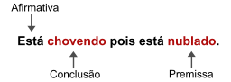
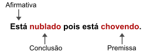
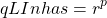
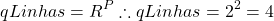
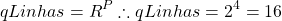

# Como identificar Falácias

Falácias são afirmações ditas com tom de cultura e eloquência mas que na realidade são falsas. Como identificá-las? Este artigo apresenta um método matemático para identificar falácias.

Conteúdo

*   1 Tabela Verdade
*   2 Exemplo de teste
*   3 Construindo a Tabela
    *   3.1 Exemplo de preenchimento de Tabela com 4 premissas
    *   3.2 Preenchendo a Tabela
*   4 Identificando o objetivo
*   5 Aplicando

## Tabela Verdade

Tabela verdade é um método de verificação de lógica, se pode ser chamada disso, que tem por objetivo verificar se as sentenças e/ou suas combinações são verdadeiras diante das premissas. Conteúdo indispensável para os cursos de **Ciência da Computação** e **Engenharia da computação**, a _tabela verdade_ tem por objetivo – nestas áreas – de explicar a lógica computacional básica, por traz dos mais simples processadores.

Neste artigo, o conteúdo que é extremamente complexo e profundo será resumido e sintetizado de forma superficial e simples, apenas para sua aplicação dentro do escopo: identificar falácias.

## Exemplo de teste

A tabela verdade trabalha com valores booleanos, ou seja, valor verdadeiro ou falso, ou ainda, “1” ou “0”. Não há meio termo! Ou é ou não é. Como exemplo de construção de tabela verdade, para validação de asserção, tome como exemplo as duas frases a seguir:

1.  Está chovendo pois está nublado.
2.  Está nublado pois está chovendo.

Estas frases são muito simples e, podem, com muita facilidade, ser identificadas como verdadeiras ou falsas. Contudo, perceba que a diferença entre elas é muito sutil.

Ambas fazem uma conclusão baseando-se em uma premissa. A primeira conclui que está chovendo “**porque**” está nublado, ou seja, a primeira frase tem como argumentativa de que o simples fato de haver nuvens cobrindo todo o céu figura como premissa suficiente para concluir que está chovendo.

Já a segunda, também faz uma conclusão baseando-se numa premissa. Ela conclui que está nublado “**porque**” está chovendo. Portanto, a segunda frase conclui que o simples fato haver chuva é por si mesmo, premissa suficiente para afirmar que está nublado.

## Construindo a Tabela

Para construir a tabela primeiro tem-se que identificar que o valores são booleanos ou binários, o que significa que há apenas duas possibilidades: verdadeiro ou falso; ou então, 1 ou 0; Ambos estão corretos. A segunda necessidade é identificar quantas são as premissas.

Para saber quantas linhas a tabela deve ter, utilize a seguinte fórmula:

(1)   

Onde **_R_** é a quantidade de resposta possíveis (verdadeiro/falso ou 1/0) e, **_P_** é a quantidade de premissas.

Portanto, para o exemplo, tem-se:

(2)   

Assim, a tabela deve ter 4 (quatro) linhas e, uma coluna para cada premissa, ficando da seguinte forma:

<table cellspacing="0" cellpadding="0" class="zebra c1title" style="min-width: 5em !important;max-width:15em;"><tbody><tr class="title"><td style="width: 2em !important;"></td><td>Premissa 1 Chuva</td><td>Premissa 2 Nublado</td></tr><tr><td>1</td><td></td><td></td></tr><tr><td>2</td><td></td><td></td></tr><tr><td>3</td><td></td><td></td></tr><tr><td>4</td><td></td><td></td></tr></tbody></table>

### Exemplo de preenchimento de Tabela com 4 premissas

Para preencher a tabela, independente de quantidade de linhas ou colunas é muito simples. Se as respostas possíveis são duas, verdadeiro/falso ou 1/0, então, da direita para esquerda será intercalado nas mesma quantidade (2) verticalmente as possibilidades. Veja uma **exemplo** mais complexo, para o caso de duas respostas e 4 (quatro) premissas (note que “1” é verdadeiro e “0” é falso):

(3)   

<table cellspacing="0" cellpadding="0" class="zebra c1title" style="min-width: 5em !important;"><tbody><tr class="title"><td style="width: 2em !important;"></td><td>Premissa 1 Coluna 4 <i>Intercala de oito em oito</i></td><td>Premissa 2 Coluna 3 <i>Intercala de quatro em quatro</i></td><td>Premissa 3 Coluna 2 <i>Intercala de dois em dois</i></td><td>Premissa 4 Coluna 1 <i>Intercala de um em um</i></td></tr><tr><td>1</td><td><strong>0</strong></td><td><strong>0</strong></td><td><strong>0</strong></td><td><strong>0</strong></td></tr><tr><td>2</td><td><strong>0</strong></td><td><strong>0</strong></td><td><strong>0</strong></td><td>1</td></tr><tr><td>3</td><td><strong>0</strong></td><td><strong>0</strong></td><td>1</td><td>0</td></tr><tr><td>4</td><td><strong>0</strong></td><td><strong>0</strong></td><td>1</td><td>1</td></tr><tr><td>5</td><td><strong>0</strong></td><td>1</td><td>0</td><td>0</td></tr><tr><td>6</td><td><strong>0</strong></td><td>1</td><td>0</td><td>1</td></tr><tr><td>7</td><td><strong>0</strong></td><td>1</td><td>1</td><td>0</td></tr><tr><td>8</td><td><strong>0</strong></td><td>1</td><td>1</td><td>1</td></tr><tr><td>9</td><td>1</td><td>0</td><td>0</td><td>0</td></tr><tr><td>10</td><td>1</td><td>0</td><td>0</td><td>1</td></tr><tr><td>11</td><td>1</td><td>0</td><td>1</td><td>0</td></tr><tr><td>12</td><td>1</td><td>0</td><td>1</td><td>1</td></tr><tr><td>13</td><td>1</td><td>1</td><td>0</td><td>0</td></tr><tr><td>14</td><td>1</td><td>1</td><td>0</td><td>1</td></tr><tr><td>15</td><td>1</td><td>1</td><td>1</td><td>0</td></tr><tr><td>16</td><td>1</td><td>1</td><td>1</td><td>1</td></tr></tbody></table>

Perceba que o preenchimento é feito na vertical, de cima para baixo e depois da direita para a esquerda. Assim, na primeira coluna da direita para a esquerda, preenche-se verticalmente intercalando de um em um, 0, 1, 0, 1, … Já na segunda coluna, dobra-se o valor e, preenche-se intercalando de dois em dois, 0, 0, 1, 1, 0, 0, … Na terceira dobra-se novamente, intercalando verticalmente de quatro em quatro 0, 0, 0, 0, 1, 1, 1, 1… Isso se faz até preencher todas as colunas, sempre dobrando a quantidade de intercalamento.

Este preenchimento garante que **todas as possibilidades** de combinação foram satisfeitas.

### Preenchendo a Tabela

Voltando, seguindo o exemplo anterior, o preenchimento da tabela para resolver a questão das nuvens e da chuva fica da seguinte forma:

<table cellspacing="0" cellpadding="0" class="zebra c1title" style="min-width: 5em !important;max-width:15em;"><tbody><tr class="title"><td style="width: 2em !important;"></td><td>Premissa 1 Chuva</td><td>Premissa 2 Nublado</td></tr><tr><td>1</td><td>0</td><td>0</td></tr><tr><td>2</td><td>0</td><td>1</td></tr><tr><td>3</td><td>1</td><td>0</td></tr><tr><td>4</td><td>1</td><td>1</td></tr></tbody></table>

A tabela acima é a mesma que a tabela abaixo, apenas usa-se notação diferente:

<table cellspacing="0" cellpadding="0" class="zebra c1title" style="min-width: 5em !important;max-width:15em;"><tbody><tr class="title"><td style="width: 2em !important;"></td><td>Premissa 1 Chuva</td><td>Premissa 2 Nublado</td></tr><tr><td>1</td><td>Falso</td><td>Falso</td></tr><tr><td>2</td><td>Falso</td><td>Verdadeiro</td></tr><tr><td>3</td><td>Verdadeiro</td><td>Falso</td></tr><tr><td>4</td><td>Verdadeiro</td><td>Verdadeiro</td></tr></tbody></table>

## Identificando o objetivo

Basicamente o que se quer fazer é verificar se as combinações das premissas podem ou não ser verdadeiras. Esta verificação preenche todas as possibilidades e, permite identificar se há impossibilidades.

Contudo, para realizar a combinação das premissas, deve-se entender o contexto e o objetivo. Há 3 tipos de combinações:

*   “**E**” ou “**AND**“, significa exatamente o que elas representam na língua. Elas fazem a exigência de que ambas as premissas sejam verdadeiras. Um exemplo é: “_gosto de comida simples e quente_“. O “e” exige que ambas as condições sejam atendidas, não podendo ser apenas uma delas.
*   “**OU**” ou “**OR**“, igualmente significam o que de fato a língua expressa. Esta conjunção indica que qualquer uma das condições atendidas já é o suficiente, não havendo, portanto, necessidade de que ambas sejam atendidas, mas exige que pelo menos uma seja. Exemplo: “_Prefiro pastel ou cachorro quente_“. Esta frase exige que pelo menos **uma** ou ambas as condições sejam atendidas.
*   “**OU ENTÃO**” ou “**XOR**” ou “**OU EXCLUSIVO**“, significam que deve-se atender **apenas** uma das condições, ou seja, não pode ser todas e, também não pode ser nenhuma. **É uma ou então outra**! Exemplo: “_Você tem que escolher, ou ela ou então eu_“. Esta frase coloca uma decisão alternativa, não há opção de escolher ambas e, também não há opção de não escolher nenhuma.

Para o escopo do problema da chuva e das nuvens, o que se quer saber é se a combinação de ambas as premissas são possíveis. Mas não da premissa em si, mas da resposta à premissa. Normalmente, em lógica matemática, verificar-se-ia apenas as premissas e não as respostas à premissas. Mas aqui, o objetivo é entender se a combinação das respostas são válidas.

Portanto, de forma simples, a combinação das possibilidades de cada linha é possível? É lógica? Usaremos a lógica “E”, para validar, de forma abstrata e não direta.

## Aplicando

Para aplicar este conceito, agora precisa-se adicionar uma coluna à tabela com a pergunta: “_isso é possível?_“:

<table cellspacing="0" cellpadding="0" class="zebra c1title" style="min-width: 5em !important;"><tbody><tr class="title"><td style="width: 2em !important;"></td><td>Premissa 1 Chuva</td><td>Premissa 2 Nublado</td><td>Isso é Possível?</td></tr><tr><td>1</td><td>Falso</td><td>Falso</td><td></td></tr><tr><td>2</td><td>Falso</td><td>Verdadeiro</td><td></td></tr><tr><td>3</td><td>Verdadeiro</td><td>Falso</td><td></td></tr><tr><td>4</td><td>Verdadeiro</td><td>Verdadeiro</td><td></td></tr></tbody></table>

E para cada linha adicionar se a combinação a “**E**” das respostas à premissa são verdadeiras. E como fazer isso? É simples, para cada liinha faça a pergunta:

*   LINHA 1 – é possível não chover **e** não estar nublado? **sim**;
*   LINHA 2 – é possível não chover **e** estar nublado? **sim**;
*   LINHA 3 – é possível chover **e** não estar nublado:? **não**;
*   LINHA 4 – é possível chover **e** estar nublado? **sim**.

Assim, a tabela deve ficar assim:

<table cellspacing="0" cellpadding="0" class="zebra c1title" style="min-width: 5em !important;"><tbody><tr class="title"><td style="width: 2em !important;"></td><td>Premissa 1 Chuva</td><td>Premissa 2 Nublado</td><td>Isso é Possível?</td></tr><tr><td>1</td><td>Falso</td><td>Falso</td><td>Verdadeiro</td></tr><tr><td>2</td><td>Falso</td><td>Verdadeiro</td><td>Verdadeiro</td></tr><tr><td>3</td><td>Verdadeiro</td><td>Falso</td><td>Falso</td></tr><tr><td>4</td><td>Verdadeiro</td><td>Verdadeiro</td><td>Verdadeiro</td></tr></tbody></table>

Perceba que, das 4 (quatro) possibilidades, apenas uma combinação é impossível, a 3º linha. Além disso a tabela revela todas as possibilidades.

O que isso significa?

1.  que é impossível chover sem nuvens – linha 3º;
2.  que é possível estar nublado e não haver chuva – linha 2º.

Portanto, simplesmente com esta tabela pode-se afirmar, categoricamente, que a afirmativa “_Está chovendo pois está nublado_” é falsa, ainda que soe de forma culta ou eloquente, é uma **falácia**. O simples fato de estar nublado não é, por si mesmo, suficiente para concluir que está chovendo, ainda que, possa acertar eventualmente, pois há situações em que está nublado e não há chuva. Logo, a frase é falsa.

Obviamente que o exemplo dado é muito simples, contudo, serve apenas para demonstrar o poder da matemática para a ciência e, sua importância para validação de asserções, especialmente científicas.

Originalmente publicado em **16/ago/2020**.
