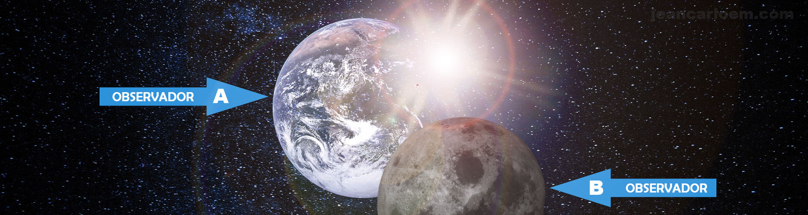
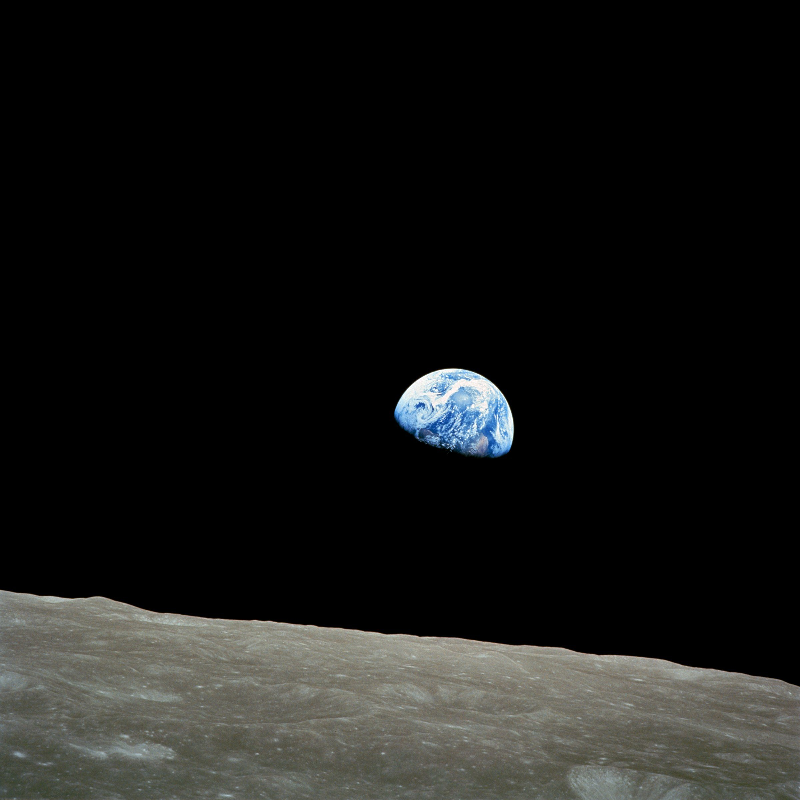

 
# Devaneios

> Penso, logo Existo
> > > — [Descartes](https://web.archive.org/web/20230209191918/https://pt.wikipedia.org/wiki/Descartes)

O [renascentismo](https://web.archive.org/web/20230209191918/https://pt.wikipedia.org/wiki/Renascentismo) e [iluminismo](https://web.archive.org/web/20230209191918/https://pt.wikipedia.org/wiki/Iluminismo) foram entre muitos outros, os principais agentes a proporcionar que a “filosofia” da _“era das luzes”_ e _“era das trevas,”_ perdurasse por anos a fio. Muito embora hoje, distantes dos fatos, exista alguns que preguem uma idade média sem um mergulho profundo à obscuridade e ignorância[^1], abster-se dos fatos, porém, propondo que não houve qualquer tipo de declínio ou limitação imposta pelo agente dominante da época através de métodos como crendice, tortura, encarceramento e condenação[^2] – que em alguns casos era condenação à morte[^3] – para coagir, erradicar e limitar pensamentos que o contradissessem, como no [caso de Galileu Galilei](https://web.archive.org/web/20230209191918/https://en.wikipedia.org/wiki/Galileo_affair), é um extremo que não reflete a realidade[^4][^5][^6] e é tão prejudicial e fictício[^7] como qualquer mito. Mas é neste tempo conturbado[^8] advindo da [idade média](https://web.archive.org/web/20230209191918/https://pt.wikipedia.org/wiki/Idade%20M%C3%A9diada), preconceituosamente[^1] (até certo ponto) pintado pelos intelectuais da época como “tempo de ignorância e superstição”[^9] _onde os dogmas e crendices sobrepunham ao racionalismo e experiência pessoal[^1], e cultivava um crescente declínio cultural_[^10] – não é a toa a denominação desse período por alguns intelectuais de  [”idade das trevas”](https://web.archive.org/web/20230209191918/https://pt.wikipedia.org/wiki/%E2%80%9Didade%20das%20trevas%E2%80%9D) e a existência de inúmeras crenças populares, muitas das quais, ainda acreditadas hoje[^11] – perdido entre tantas teorias, questionando-se sobre tudo, é que o renomado filósofo [Descartes](https://web.archive.org/web/20230209191918/https://pt.wikipedia.org/wiki/Descartes) expressa o pensamento supra.

Conteúdo

*   1 A Realidade
*   2 Convicções
    *   2.1 Conhecimento, a base das convicções
        *   2.1.1 Conhecimento Relativo
        *   2.1.2 Conhecimento Absoluto
        *   2.1.3 A falibilidade do Conhecimento Humano
        *   2.1.4 Conhecimento VS Verdade
            *   2.1.4.1 O Conhecimento ≠ Verdade
            *   2.1.4.2 O Conhecimento = Verdade
        
    *   2.2 Processamento do conhecimento
    
*   3 Um Castelo de Cartas
*   4 A Insuficiência Humana
*   5 Referencias
*   6 Bibliografia

# A Realidade

O que é real? O que é verdade? As vezes parece que todas as alternativas demonstram verdade, e noutras não há alternativa. Como distinguir então? E se tudo em que se acredita é irreal? E se o que é presenciado, sentindo e até mesmo cientificamente provado for apenas uma mera ilusão? E se nada é o que parece, e como numa ficção futurista, todos estivessem desde sempre, presos à [Matrix?](https://web.archive.org/web/20230209191918/https://pt.wikipedia.org/wiki/Matrix)

> Ora, quem pode assegurar que (…) não haja nenhuma terra, nenhum céu, nenhum corpo extenso, nenhuma figura, nenhuma grandeza, nenhum lugar e que, não obstante, eu tenha o sentimento de todas essas coisas … E, mesmo, (…) que eu me engane todas as vezes em que faço a adição de dois mais três, ou em que enumero os lados de um quadrado, ou faço outra coisa que se possa imaginar ainda mais fácil?
> > > — Descartes[^12]

Foi em meio a tantas perguntas[^12], questionando a própria existência[^13], que Descartes concluiu a primeira certeza: “duvido, logo existo”, e como duvidar é um modo de pensar então: _“Cogito ergo sum”,_ em português: _“Penso, logo existo”_.  Ele não poderia questionar que estivesse duvidando, pois assim ele simplesmente confirmaria que estava duvidando. A existência de pensamento sobre a própria existência, prova em si, a existência de um “eu” para fazer o pensamento. Na verdade Descartes não foi o único a expor esta ideia, filósofos como [Platão](https://web.archive.org/web/20230209191918/https://pt.wikipedia.org/wiki/Plat%C3%A3o), [Aristóteles](https://web.archive.org/web/20230209191918/https://pt.wikipedia.org/wiki/Arist%C3%B3teles) e [Parmênides](https://web.archive.org/web/20230209191918/https://pt.wikipedia.org/wiki/Parm%C3%AAnides) [^14] também esboçaram pensamentos semelhantes:

> … estamos conscientes de que percebemos, e quando pensamos, estamos conscientes de que nós pensamos, e estar conscientes de que estamos percebendo ou pensando é estar consciente de que existimos
> > > — Aristóteles em [Ética a Nicômaco](https://web.archive.org/web/20230209191918/https://pt.wikipedia.org/wiki/%C3%89tica%20a%20Nic%C3%B4maco)

Os humanos da recém inaugurada [idade moderna](https://web.archive.org/web/20230209191918/https://pt.wikipedia.org/wiki/Idade%20moderna) “partiram” desta premissa e galgaram o desconhecido em busca de novas verdades, questionando, repensando e provando. Surge então o que hoje é denominado “método científico”[^15]

# Convicções

O dicionário define “convicção” como “certeza” e associa o substantivo “crença”[^16] à convicção como um sinônimo ao defini-la como “convicção íntima”[^17][^18][^19]. Exemplificando, aquele que é convicto, crê; da mesma forma, o que crê, é convicto. Se o indivíduo crê, ou seja é convicto, ele tem uma crença[^20], uma convicção. Convicção é algo que se tem, embora conceitualmente intangível. Neste artigo “convicção” será melhor analisada, mas por ora, conforme definição do dicionário, pode-se concluir convicção como:

> *   Certeza;
> > *   Crença;
> > *   Opinião[^21];
> > *   “
> > > — Ideia
> > na qual se
> > > — acredita
> > e portanto se tem como
> > > — certa
> > .”

Em termos práticos, convicção é o resultado natural do pensamento humano[^22][^23]. Mas humanos pensam? De fato todos pensam, talvez não da forma como deveriam, da forma correta, se é que existe uma forma correta. Mas pensam! Baseado no conhecimento adquirido até o presente, formam-se [convicções](https://web.archive.org/web/20230209191918/https://pt.wiktionary.org/wiki/convic%C3%A7%C3%A3o) sobre o que é real e o que não é, sobre o que é verdade e o que é falso. Independentemente do grau e profundidade do conhecimento adquirido, é sobre ele[^22][^23][^24][^25], que se baseiam todos os princípios, crenças e convicções.

## Conhecimento, a base das convicções

Não conhecemos porque  cremos, mas sim, cremos porque conhecemos. Não é da convicção que se obtém conhecimento, mas do conhecimento é que se forma convicção (crença). Para crer em “algo” (ser convicto de “algo”), é necessário antes ter conhecimento sobre “algo”.  É impossível extrair conhecimento de uma crença, e é impossível crer em algo do qual não se tem conhecimento. Então, na história da “origem”, primeiro vem o conhecimento, e depois, baseado neste conhecimento, a convicção. A convicção (crença) nada mais é que o resultado natural da reflexão do conhecimento[^22][^23].

Tome como exemplo um homem que está viajando, e em sua viagem passa, sem saber, por um local onde é costume construírem fachadas de restaurantes beirando a estrada – não cabe aqui o motivo da construção estas fachadas, mas o fato de serem construídas. Este homem, ao passar pela estrada verá, o que para ele, são restaurantes, simplesmente porque ele possui conhecimento obtido através de sua experiência anterior, da aparência de um restaurante, e também porque pode ler perfeitamente os letreiros beirando a estrada com os dizeres “restaurantes”. O Homem adquiriu um conhecimento – ele vê o que parecer ser vários restaurantes – e está convicto disso (crê). Coincidentemente entre estas dezenas de fachadas de restaurantes, existe um que é real, onde ele por obra do acaso estaciona e entra. Ao entrar confirma ainda mais o conhecimento anteriormente obtido: ele realmente vê um verdadeiro restaurante.

Perceba neste exemplo que o homem possui uma convicção (crença), baseada em conhecimento factual, entretanto esta crença é incorreta. Não é a verdade! O único motivo para ele crer que são restaurantes é porque tem evidencias de que são, e nada que o leve a duvidar desta certeza. Ele não possui qualquer evidência – e neste caso evidência seria conhecimento – de que o que ele vê não é real. Perceba, que ele crê porque tem conhecimento – mesmo que questionável – e não o contrário. Crer sem conhecimento é impossível[^22][^23].

> Existe apenas um bem, o saber, e apenas um mal, a ignorância
> > > — [Sócrates](https://web.archive.org/web/20230209191918/https://pt.wikipedia.org/wiki/S%C3%B3crates)

É neste ponto que Sócrates é certeiro ao classificar o bem e o mal, relacionando-os ao saber e à ignorância respectivamente, uma vez que é sobre o conhecimento adquirido que os humanos definem suas convicções. Sem conhecimento não é possível crer em qualquer coisa. Assim, conhecimento, bem como o grau e profundidade do mesmo, passa a ser essencial para formação de corretas convicções. Conhecimento superficial ou baseado em leitura unilateral ou equivocada de evidencia(s) leva a formação de falsas convicções. Mas aí surge o problema…

### Conhecimento Relativo
> Todo conhecimento humano é relativo. Cada subida prepara a queda proporcional. Cada fossa abre espaço para a altura equivalente. No final da estrada estamos no mesmo ponto de onde saímos, no zero, no nada.
> > > — [Carlos Heitor Cony](https://web.archive.org/web/20230209191918/https://pt.wikipedia.org/wiki/Carlos%20Heitor%20Cony)

A relatividade é um conceito amplo, antigo[^26] e cientificamente verificável[^27][^28][^29] haja visto a [Teoria da relatividade](https://web.archive.org/web/20230209191918/https://pt.wikipedia.org/wiki/Teoria%20da%20relatividade) de [Albert Einstein](https://web.archive.org/web/20230209191918/https://pt.wikipedia.org/wiki/Albert%20Einstein) que demonstra a aplicabilidade à física, matemática e portanto ao cosmo – embora notadamente não comprovada. Filósofos e cientistas como Galileu[^26] e Protágoras já esboçaram esta teoria:

> O homem é a medida de todas as coisas.
> > > — [Protágoras](https://web.archive.org/web/20230209191918/https://pt.wikipedia.org/wiki/Prot%C3%A1goras)

Existem muitas alegorias que tentam ilustrar a relatividade. Uma delas, simplória, mas o suficiente para o caso, considera a existência de dois observadores. Um deles encontra-se na lua _(B)_, enquanto o outro na terra _(A)_. Do ponto de vista do observador _“B”_, a terra gira em torno da lua, e do ponto de vista do observador _“A”_, é a lua que gira em torno da terra. Ambos tiram sua conclusão em evidências verificáveis. Qualquer um pode olhar ao céu e observar a evidência diante de seus olhos, e diante destas evidencias ambos estão corretos. Neste caso o conhecimento é relativo à perceptiva do observador e ao método utilizado. Entretanto o conhecimento obtido através da perspectiva do observador limita a compreensão do todo.

Este exemplo, bem como o “das fachadas de restaurantes”, demonstram a relatividade do conhecimento humano indicando também a fragilidade humana na percepção do todo, o que prejudica notoriamente suas convicções. Por isso talvez, nenhum dos pontos, relativismo ou absolutismo, está correto, mas possivelmente um “_convergencialismo_“.

### Conhecimento Absoluto
> … \[algo\] não depende, para sua existência, da minha atual percepção do mesmo
> > > — [Taylor](https://web.archive.org/web/20230209191918/https://pt.wikipedia.org/wiki/Taylor) [^30][^31]

Devido a verificabilidade do “conhecimento relativo”, existe uma enorme controversa entre a existência ou não de um “conhecimento absoluto”, aquele conhecimento que não depende do observador, reflexo exato da realidade. Mas no final, é racional concluir que existe um “conhecimento absoluto”, que independentemente do conhecimento humano (relativo), continuará a ser absoluto. A percepção humana do “conhecimento absoluto” não o mudará, e tão pouco o “conhecimento relativo” tornar-se-á absoluto pela convicção nele. Não há nada que a convicção humana faça para mudar a realidade. A lua continuará girando em torno da terra, mesmo que para o observador “B”, da ilustração anterior, seja que a “terra gira em torno da lua”, convicção esta concluída com base no conhecimento relativo verificável. Da mesma forma, as fachadas de restaurantes beirando a estrada – do exemplo anterior – não se transmutarão em verdadeiros restaurantes simplesmente porque o observador assim crê. A realidade é o que é, independente do “conhecimento” e convicção do ser humano (observador).

### A falibilidade do Conhecimento Humano
> Todo mundo tem direito à sua própria opinião, mas não aos seus próprios fatos.
> > > — [Daniel Patrick Moynihan](https://web.archive.org/web/20230209191918/https://pt.wikipedia.org/wiki/Daniel%20Patrick%20Moynihan) [^32]

Da mesma forma que a percepção humana não muda ou desvirtua o “conhecimento absoluto”, o mesmo, não invalidará necessariamente o “conhecimento relativo” obtido da perspectiva humana, já que há possibilidade de que a perspectiva humana e o método utilizado traduzam um conhecimento relativo que reflita com exatidão pelo menos um fração do “conhecimento absoluto”.

Entretanto é impossível ao homem saber, para além do questionamento e independentemente do método ou da perspectiva, se determinado conhecimento é absoluto, uma vez que o conhecimento é ilimitado e a capacidade cerebral humana é limitada[^33] – limite este ainda desconhecido[^33]. “Colocar” o conhecimento infinito em um recipiente (cérebro) finito[^34] é irracional, e traduz a impossibilidade humana de compreender a totalidade do conhecimento[^35]. Além disso, uma percepção não relativista exigiria do homem extrapolar sua própria existência a fim de perceber “o todo” de forma impessoal. 

É com o que o biólogo britânico nascido no brasil e ganhador do [Prêmio Nobel](https://web.archive.org/web/20230209191918/https://pt.wikipedia.org/wiki/Pr%C3%AAmio%20Nobel), [Peter Brian Medawar](https://web.archive.org/web/20230209191918/https://pt.wikipedia.org/wiki/Peter%20Brian%20Medawar), parece concordar ao declarar: “Os limites da ciência transparecem na sua **incapacidade** de responder a perguntas básicas, como as que fazem as crianças, perguntas sobre as primeiras e as últimas coisas: ‘Como tudo começou?’, ‘Porque estamos aqui?’, ‘Qual o sentido da existência?'”[^36], e ele não está sozinho, uma vez que [Francis Collins](https://web.archive.org/web/20230209191918/https://pt.wikipedia.org/wiki/Francis%20Collins), [geneticista](https://web.archive.org/web/20230209191918/https://pt.wikipedia.org/wiki/Gen%C3%A9tica) diretor do [Projeto Genoma Humano](https://web.archive.org/web/20230209191918/https://pt.wikipedia.org/wiki/Projeto%20Genoma%20Humano) e responsável pelo mapeamento do [DNA](https://web.archive.org/web/20230209191918/https://pt.wikipedia.org/wiki/DNA) humano, afirmou:

> A ciência é **impotente** para responder a perguntas fundamentais. Francis Collins

Portanto qualquer convicção formada à partir de conhecimento parcial humano e lida à partir da estreita lente humana – adiante explicado – resultará  definitivamente em convicções incoerentes, polêmicas e possivelmente falsas. Resta apenas a crença efêmera de que a percepção e os métodos utilizados reflitam, em algum momento, uma fração do “conhecimento absoluto”.

> A forma mais rápida de um cientista desacreditar a si, e à sua profissão, é declarar audaciosamente (sobretudo quando não há necessidade), que a ciência sabe, ou um dia saberá, as respostas de todas as perguntas da vida. E que são irrelevantes as perguntas que não podem ser respondidas cientificamente, ou pseudo-perguntas feitas por ignorantes e respondidas por crédulos.[Peter Brian Medawar](https://web.archive.org/web/20230209191918/https://pt.wikipedia.org/wiki/Peter%20Brian%20Medawar), Conselhos a um jovem cientista
### Conhecimento VS Verdade

Muitas vezes conhecimento e verdade podem ser confundidos, entretanto conhecimento não é necessariamente verdade. Para compreender melhor, o dicionário lança luz à este conceito ao definir verdade da seguinte forma:

> *   Conformidade com o real; **exatidão, realidade**: _a verdade do ocorrido_;
> > *   Coisa verdadeira ou certa: _A verdade foi escamoteada por todos._
> > *   Princípio certo: _A maioria das doutrinas políticas apresenta erros e verdades._
> > *   **Representação
> > > — fiel
> > de alguma coisa da natureza**: Há verdade neste quadro.
> > > — Dicionário Aurélio[^37]
#### O Conhecimento ≠ Verdade

A definição que o dicionário Aurélio dá para o substantivo “verdade” é esclarecedor. Um conhecimento ou convicção que não reflete exatamente a realidade, não pode ser considerado verdade. É impossível existir “verdade relativa”, uma vez que por definição verdade é a exata realidade, do contrário não seria verdade. Perceba o paradoxo de uma “verdade relativa”. Racionalizando, uma “verdade relativa” se auto aniquila, afinal seria isto – “verdade relativa” – uma verdade ou também é relativo? Verdade é um conceito absoluto[^38]. Se o indivíduo tem conhecimento ou convicção de “algo” que não é a realidade em si, então não é verdade!

O conhecimento e a convicção do observador (B) do exemplo da terra e da lua anterior não é uma verdade, e muito menos uma “verdade relativa”. Pode até ser um “conhecimento relativo”, uma vez que o conhecimento do observador é relativo à sua percepção, mas por definição não é uma verdade, e sim uma mentira, pois não reflete a realidade com exatidão. A verdade não é condicionada, influenciada ou dependente de convicção ou percepção humana, ela está além. Verdade é verdade e pronto. Qualquer “coisa” diferente, é mentira. Mesmo que um dado indivíduo considere tal convicção como verdade, a consideração do mesmo não influenciará o estado da verdade:

> O que é absolutamente verdade é sempre correto, em todos os lugares, o tempo todo, em qualquer condição. Capacidade de uma entidade de discernir estas coisas é irrelevante para o estado da verdade
> > > — [Steven Robiner](https://web.archive.org/web/20230209191918/https://en.wikipedia.org/wiki/Steven%20Robiner) [^39]
> Conhecimento RELATIVO é **DIFERENTE** da VERDADE
#### O Conhecimento = Verdade

Como demonstrado anteriormente, verificou-se existência de um “conhecimento absoluto”, que existe independente do observador. Este conhecimento, impossível ao homem de ser obtido, é a totalidade exata da realidade. Portanto, no que se refere ao “conhecimento absoluto”, pode-se afirmar sem sombra de dúvida, que conhecimento é igual a verdade. Conclui-se portanto que “conhecimento absoluto” e verdade são sinônimos.

> Conhecimento ABSOLUTO é **IGUAL** a VERDADE
## Processamento do conhecimento

Mas não bastasse a limitação do “conhecimento relativo” em função da perspectiva e dos métodos do observador, existe ainda uma camada adicional entre o conhecimento e a convicção. O conhecimento não é o único fator determinante na definição de uma convicção. Se não houvesse esta camada, poder-se-ia dizer que conhecimento é igual à convicção, mas isso foge do observado. O que se observa em muitas situações é a interpretação (leitura) de um mesmo “conhecimento relativo” de formas diferentes que resultam em convicções diversas.Para ilustrar esta camada de forma mais evidente, considere a seguinte ilustração: dois observadores “A” e “B”, observam um mesmo objeto, neste caso um copo, com capacidade total de 300 ml, preenchido com a quantidade exata de 150 ml de água. Ambos observam de uma mesma perspectiva (lente), ambos “absorvem” exatamente o mesmo “conhecimento”. Diferente dos observadores do exemplo da “lua e da terra”, que recebem informações diferentes, estes agora, recebem exatamente a mesma informação.

Entretanto o conhecimento por si só não é nada. É necessário aos observadores processar o conhecimento adquirido. Assim o resultado natural deste processamento, ou como preferir, leitura, reflexão ou análise – que neste artigo são sinônimos – será uma convicção[^23]. Assim a forma como cada observador analisa os dados recebidos, influenciará completa e distintamente o resultando deste processamento, e portanto a convicção de cada um. Para o observador “A”, o copo está “meio cheio”, enquanto para o observador “B”, o copo está “meio vazio”. Todas as afirmações fazem sentido e refletem a informação tal como ela foi absorvida por ambos, mas possuem sentidos opostos, convicções diferentes à respeito de um mesmo conhecimento. Neste caso, a lente pela qual é analisada uma mesma informação define a convicção. Portanto convicção é o resultado natural da reflexão/análise do conhecimento relativo em que se baseia. [Thomas S. Kuhn](https://web.archive.org/web/20230209191918/https://pt.wikipedia.org/wiki/Thomas_Kuhn) confirmou este pensamento ao afirmar o seguinte:

> O que um homem vê, depende tanto daquilo que ele olha como daquilo que sua **experiência visual-conceitual prévia o ensinou a ver**.” Thomas S. Kuhn, A estrutura das revoluções científicas

Em outras palavras, isto significa que se não em todos o casos, pelo menos na maioria, o ser humano enxergará um fato ou evidência da forma como ele quer ver, da forma como ele se condicionou a ver; e não necessariamente da forma que realmente é.

# Um Castelo de Cartas

Definitivamente, parece vã a confiança depositada no conhecimento humano, sobretudo nos conceitos por eles extraídos, mesmo quando se dá o nome de ciência. De fato, meses depois, pode-se mudar por completo o que outrora acreditava-se como empírico. Mas a situação se agrava ainda mais quando se leva em consideração que muitos, inclusive cientistas, são levados a dar créditos à declarações e afirmações simplesmente por serem emitidas por pessoas de renome.

Existe um perigo real e invariavelmente ilógico, de se tomar uma afirmação de um cientista, como uma afirmação científica. Como [John Lennox](https://web.archive.org/web/20230209191918/https://pt.wikipedia.org/wiki/John%20Lennox), matemático e professor da [Universidade de Oxford](https://web.archive.org/web/20230209191918/https://pt.wikipedia.org/wiki/Universidade%20de%20Oxford) afirmou: “a ilogicidade é disfarçada pelo fato de ter sido dita por um cientista. No debate contemporâneo existe o perigo muito real de confundir ‘enunciado \[afirmação\] de um cientista’, com um ‘enunciado \[afirmação\] científico’. nem todo enunciado \[afirmação\] feito por um cientista é um ‘enunciado \[afirmação\] cientifico’. Por isso não tem a mesma autoridade que atribuímos à ciência em si. **Um enorme prestígio e autoridade não justificam uma lógica falaciosa**.”[^40]. Não é por ser alguém de intelecto a declarar, que suas afirmações serão verdade. Opinião não é o mesmo que fato como declarou [Daniel Patrick Moynihan:](https://web.archive.org/web/20230209191918/https://pt.wikipedia.org/wiki/Daniel%20Patrick%20Moynihan) “Todo mundo tem direito à sua própria opinião, mas não aos seus próprios fatos“[^32]. Contudo, mesmo que sejam de fato afirmações científicas, não significa que representem necessariamente a verdade/conhecimento absoluto, como já visto, mas apenas e provavelmente um conhecimento relativo, lido e refletido por uma estreita lente, que cedo ou tarde poderá se mostrar falho, e inevitavelmente abandonado, como relata a história.

Neste intervalo, inúmeras teorias mirabolantes formam-se no que não passa de mito, opiniões particulares de um cientista ou grupo de cientistas de prestígio. Muito do que hoje é considerado ciência nada mais é que um castelo de cartas frágeis tão bem posicionadas e equilibradas que passam uma falsa e intensa sensação de serem sólidas e confiáveis. Teorias baseadas em teorias e conceitos baseados em opinião. Por falta de bases verdadeiramente sólidas, cedo ou tarde o castelo de cartas virá ao chão.

# A Insuficiência Humana
> Não importa por onde eu comecei, pois para lá eu voltarei sempre.
> > > — [Parmênides](https://web.archive.org/web/20230209191918/https://pt.wikipedia.org/wiki/Parm%C3%AAnides)

Ao se referir à catástrofe de [Vajont](https://web.archive.org/web/20230209191918/https://pt.wikipedia.org/wiki/Barragem_de_Vajont), o professor da [University of East Anglia](https), [David Petley](https), declarou a respeito da capacidade humana: “Vajon demonstra a estupidez do homem em seu fracasso em entender os sistemas naturais“[^41]. Não há dúvida que as convicções humanas, mesmo aquelas que são tachadas factuais pela dita “ciência dominante”, são na verdade racionalizações individuais e controversas de um conhecimento puramente relativo e especulativo. Como na brincadeira [”telefone sem fio”](https://web.archive.org/web/20230209191918/https://pt.wikipedia.org/wiki/Telefone%20sem%20fio%20(brincadeira)), o “ruído” e infinitas variáveis  incidente no inesgotável “conhecimento absoluto” até que seja, em parcela desprezível absorvido pela finita mente humana –  se é que é absorvido – é demasiado forte e longo, destruindo a efêmera chance de que o conhecimento humano, bem como suas convicções sejam  de fato o espelho da realidade.

Afinal, mesmo após séculos, o mundo continua o mesmo. O monopólio de um “pensamento dominante” que arbitrariamente e preconceituosamente discrimina, descarta, persegue e limita qualquer outro que se oponha[^42][^43][^44], sem contudo deixar de ser, como muitos outros antes e muitos outros que virão, simples **devaneios**, ilusões de mentes limitadas que somente demonstram o conturbado mundo onde nada mudou, e onde a única certeza científica à que se pode chegar ainda é: **“Penso, logo existo”,** as palavras de Carlos Cony encerram poeticamente a triste realidade humana:

> … **No final da estrada estamos no mesmo ponto de onde saímos, no zero, no nada.**
> > > — [Carlos Heitor Cony](https://web.archive.org/web/20230209191918/https://pt.wikipedia.org/wiki/Carlos%20Heitor%20Cony)
# Referencias

⬍

1.  ↑ a b c [Lindberg 2003](https://web.archive.org/web/20230209191918/https://blog.jeancarloem.com/devaneios/#ref_Lindberg_2013), pp 8.
2.  ↑ Bishop, J (2006). [Aquino sobre a Tortura](https) New Blackfriars, 87:229.
3.  ↑ \]KIRSH, Jonathan. O Manual Grande inquisidores: Uma História de Terror em Nome de Deus. HarperOne. ISBN 0-06-081699-6
4.  ↑ FINOCHIARIO, Maurice (2007) Repetindo Galileo . University of California Press.
5.  ↑ [Papal Condenação (Sentença) do Galileo, em 1633](https). [University of Missouri–Kansas City](https://web.archive.org/web/20230209191918/https://en.wikipedia.org/wiki/University%20of%20Missouri%E2%80%93Kansas%20City). _(página em [inglês)](https://web.archive.org/web/20230209191918/https://pt.wikipedia.org/wiki/Lingua_inglesa)_. Página visitada em 11/04/2014.
6.  ↑ SILVA, Rodrigo. [Evidências: Galileu Galilei, o Cientista de DEUS](https). _(página em [português)](https://web.archive.org/web/20230209191918/https://pt.wikipedia.org/wiki/Lingua%20Portuguesa)_. Página visitada em 11/04/2014.
7.  ↑ SILVA, Rodrigo. “EVIDÊNCIAS: A Idade das Trevas.” [Parte 1](https) e [Parte 2](https)  (em [português)](https://web.archive.org/web/20230209191918/https://pt.wikipedia.org/wiki/Lingua%20portuguesa). Vídeos visitado em 15/04/2014.
8.  ↑ Wikipedia. [Idade Moderna](https://web.archive.org/web/20230209191918/https://en.wikipedia.org/wiki/Early_modern_period) _(página em [inglês)](https://web.archive.org/web/20230209191918/https://pt.wikipedia.org/wiki/Lingua%20Inglesa)_. Página visitada em 15/03/2014.
9.  ↑ [Equipe Brasil Escola](https), [O conceito de Idade Média](https) por de Demercino Júnior _(página em [português)](https://web.archive.org/web/20230209191918/https://pt.wikipedia.org/wiki/Lingua%20Portuguesa)_. Página visitada em 15/03/2014.
10.  ↑ [Davies 1996](https://web.archive.org/web/20230209191918/https://blog.jeancarloem.com/devaneios/#ref_Davies_1996), pp 291-293.
11.  ↑ [Russell 1991](https://web.archive.org/web/20230209191918/https://blog.jeancarloem.com/devaneios/#ref_Lindberg_2013), pp 49 à 58.
12.  ↑ a b [AT VII](https://web.archive.org/web/20230209191918/https://blog.jeancarloem.com/devaneios/#ref_descartes_1973), pp 21. _Tradução alterada. Na tradução francesa do Duque de Luynes e, por conseguinte, na tradução para a língua portuguesa de Bento Prado Junior, na última frconase dessa passagem citada é introduzido o verbo julgar. Na tradução francesa lê-se: “(…) ou que je juge de quelque chose encore plus facile, si l’n se peut imaginer rien de plus facile que cela?”. Na brasileira lê-se “ ou em que julgo alguma coisa ainda mais fácil, se é que se pode imaginar algo mais fácil do que isso?” No original em latim, esse termo não aparece. Tendo em vista que a argumentação aqui apresentada pretende mostrar que Descartes nessa passagem visa pôr em questão a legitimidade da operação puramente mental da abstração utilizando as matemáticas como exemplo, e tendo em vista que a operação mental abstrativa não envolve um juízo, preferimos manter os termos presentes no original. No original lê-se: “vel si quid aliud facilius fingi potest”._
13.  ↑ Wikipédia. [Dúvida hiperbólica](https://web.archive.org/web/20230209191918/https://pt.wikipedia.org/wiki/D%C3%BAvida%20hiperb%C3%B3lica) _(página em [português)](https://web.archive.org/web/20230209191918/https://pt.wikipedia.org/wiki/Lingua%20Portuguesa)_. Página visitada em 07/02/2014.
14.  ↑ UOL. [Pensador: Frases de Parmênides](https) _(página em [português)](https://web.archive.org/web/20230209191918/https://pt.wikipedia.org/wiki/Lingua%20Portuguesa)_. Página visitada em 05/04/2014.
15.  ↑ Infoescola. [Surgimento do Método Científico](https) _(página em [português)](https://web.archive.org/web/20230209191918/https://pt.wikipedia.org/wiki/Lingua%20Portuguesa)_. Página visitada em 15/03/2014.
16.  ↑ _Neste artigo, vamos tratar das palavras “crença” e talvez “fé”, em sentido absoluto, sem qualquer teor ou conotação religiosa. A palavra “crença” vem do latim “credentia” (Pronuncia-se /credência/, pela pronúncia tradicional do latim), do verbo “credere” (Pronuncia-se /crédere/, pela pronúncia tradicional), “crer”, que significa “aderir pela fé, ter a firme convicção, não ter a menor sombra de dúvida”. A crença indica a persuasão que se tem da verdade de algo. Assim, podemos dizer que temos crença no “mundo” extremamente pequeno e no “mundo” dos átomos e das partículas subatômicas. A palavra “crença” indica o convencimento fundado em algum motivo, em alguma coisa que é evidente ou não, mas com elementos que induzem-na como verdade[…Cidade do Cerebro: Emotologia, Crença e Fé](https)._
17.  ↑ [Dicionário Aurélio](https://web.archive.org/web/20230209191918/https://blog.jeancarloem.com/devaneios/#ref_aurelio_2004). Convicção; Crença.
18.  ↑ [Dicionário UNESP do português contemporâneo](https://web.archive.org/web/20230209191918/https://blog.jeancarloem.com/devaneios/#dicioUnesp), Crença: pp 358; Convicção, pp 342.
19.  ↑ [Wikicionário](https://web.archive.org/web/20230209191918/https://blog.jeancarloem.com/devaneios/#wikicionario). Crença; Convicção.
20.  ↑ DPLP – Dicionário Priberam da Língua Portuguesa. [Convicções](https).
21.  ↑ [Wikicionário](https://web.archive.org/web/20230209191918/https://blog.jeancarloem.com/devaneios/#wikicionario). Opinião.
22.  ↑ a b c d BOUCHARDET, Roberta. [A imaginação na Teoria da Mente segundo Hume: Uma análise a partir do Livro I do Tratado](https) _(página em [português)](https://web.archive.org/web/20230209191918/https://pt.wikipedia.org/wiki/Lingua%20Portuguesa)_. Página visitada em 06/04/2014. _(Entende-se “impressões” como a percepção do observador, portanto, “impressões” deve ser entendidas como conhecimento, o conhecimento absorvido pelo observador)._
23.  ↑ a b c d e [Olavo de Carvalho](https://web.archive.org/web/20230209191918/https://pt.wikipedia.org/wiki/Olavo%20de%20Carvalho). [Crença e percepção](https) (página em [português)](https://web.archive.org/web/20230209191918/https://pt.wikipedia.org/wiki/Lingua%20portuguesa). Página visitada em 28/02/2014.
24.  ↑ CURTIS, Gary N.. [Falácias](https) _(página em [português)](https://web.archive.org/web/20230209191918/https://pt.wikipedia.org/wiki/Lingua%20portuguesa)_. Página visitada em 28/02/2014. (Subtende-se premissa como um conhecimento, e como é necessário existir uma premissa, há a necessidade de haver conhecimento para formação de convicção).
25.  ↑ [Unilever](https://web.archive.org/web/20230209191918/https://pt.wikipedia.org/wiki/Unilever). [Como se forma a personalidade](https) (página em [português)](https://web.archive.org/web/20230209191918/https://pt.wikipedia.org/wiki/Lingua%20portuguesa). Página visitada em 28/02/2014.
26.  ↑ a b Wikipedia. [Invariância de Galileu](https://web.archive.org/web/20230209191918/https://en.wikipedia.org/wiki/Galilean%20invariance) _(página em [inglês)](https://web.archive.org/web/20230209191918/https://pt.wikipedia.org/wiki/Lingua%20Inglesa)_. Página visitada em 08/02/2014.
27.  ↑ ROBERTS, Tom; SCHLEIF, Siegmar. (Outubro de 2007). [“Qual é a base experimental da Relatividade Especial?”](https://web.archive.org/web/20230209191918/https://www.edu-observatory.org/physics-faq/Relativity/SR/experiments.html) . _Usenet Física FAQ_ . Retirado 2008/09/17 .
28.  ↑ O Globo.  [Descoberta de par de estrelas reforça teoria da Relatividade de Einstein](https://web.archive.org/web/20230209191918/https://g1.globo.com/ciencia-e-saude/noticia/2013/04/descoberta-de-par-de-estrelas-reforca-teoria-da-relatividade-de-einstein.html) _(página em [português)](https://web.archive.org/web/20230209191918/https://pt.wikipedia.org/wiki/Lingua%20portuguesa)_. Notícia de 26/04/2013. Página visitada em 08/02/2014. 
29.  ↑ [Super Interessante](https://web.archive.org/web/20230209191918/https://pt.wikipedia.org/wiki/Super%20interessante). [A Prova que Faltava](https://web.archive.org/web/20230209191918/https://super.abril.com.br/tecnologia/curvatura-espaco-tempo-sol-prova-faltava-439102.shtml) _(página em [português)](https://web.archive.org/web/20230209191918/https://pt.wikipedia.org/wiki/Lingua%20portuguesa)_. Página visitada em 08/02/2014.
30.  ↑ TAYLOR, John. Elements of Metaphysics. Cambridge : Cambridge University Press, 1907.
31.  ↑ Tradução realizada pelo autor do artigo.
32.  ↑ a b Citado em [Robert Sobel](https://web.archive.org/web/20230209191918/https://en.wikipedia.org/wiki/Robert_Sobel) revisão ‘s de _Past Imperfect: História De acordo com os filmes_ editados por Mark C. Carnes.
33.  ↑ a b Terra. [Existe um limite para a memória no cérebro?](https) _(página em [português)](https://web.archive.org/web/20230209191918/https://pt.wikipedia.org/wiki/Lingua%20Portuguesa)_. Página visitada em 28/02/2014.
34.  ↑ Raciocinio Cristao. [O arquiteto da vida: Quanta informação o corpo humano possui?](https) _(página em [português)](https://web.archive.org/web/20230209191918/https://pt.wikipedia.org/wiki/Lingua%20Portuguesa)_. Página visitada em 19/12/2014.
35.  ↑ [History Channel](https://web.archive.org/web/20230209191918/https://blog.jeancarloem.com/History%20(TV%20channel)). [Humanos estão ficando mais “burros”, indica polêmico estudo](https://web.archive.org/web/20230209191918/https://noticias.seuhistory.com/humanos-estao-ficando-mais-burros-indica-polemico-estudo) (em [português)](https://web.archive.org/web/20230209191918/https://pt.wikipedia.org/wiki/Lingua%20portuguesa). Página visitada em 11/02/2014.
36.  ↑ MEDAWAR, Peter Brian. [Conselhos a um jovem Cientista](https://web.archive.org/web/20230209191918/https://blog.jeancarloem.com/devaneios/#CJC).
37.  ↑ [Dicionário Aurélio](https://web.archive.org/web/20230209191918/https://blog.jeancarloem.com/devaneios/#ref_aurelio_2004). Verdade. _(Destaque nossos)._
38.  ↑ [Não tenho fé suficiente para ser ateu](https://web.archive.org/web/20230209191918/https://blog.jeancarloem.com/devaneios/#fe_ateu), capítulo 1.
39.  ↑ The Temple of Reason (Deists ). [Absolute truth](https://web.archive.org/web/20230209191918/https://templeofreason.org/cyclopedia/absolute_truth.htm) _(página em [inglês)](https://web.archive.org/web/20230209191918/https://pt.wikipedia.org/wiki/Lingua%20Inglesa)_. Página visitada em 08/02/2014.
40.  ↑ [LENNOX](https://web.archive.org/web/20230209191918/https://pt.wikipedia.org/wiki/John%20Lennox), Jhon. [Analisa do livro de Stephen Hawking](https) _([inglês)](https://web.archive.org/web/20230209191918/https://pt.wikipedia.org/wiki/Lingua_inglesa)_. Página acessada em 01/08/2015.
41.  ↑ **PATLEY**, David. Professor da [University of East Anglia](https). Frase traduzida pronunciada no episódio Tsunami nas Montanhas da série documentária [Segundos Fatais](https) da [National Geographic Channel](https://web.archive.org/web/20230209191918/https://en.wikipedia.org/wiki/National_Geographic_Channel).
42.  ↑ Um exemplo claro é notadamente percebido na polêmica Evolucionismo vs Criacionismo, que é de maneira assombrosa considerada uma disputa entre Ciência e Religião. Mas nas verdade, se todos os religiosos desaparecessem do mundo, ainda assim a polêmica existira, porque a polêmica não esta entre ciência e religião, mas entre cientistas e cientistas. A ciência não é um agente/personalidade autônoma que possa falar por si só, portanto quem define o que é ciência, é a unanimidade, unica e exclusivamente através do “método científico”. E neste ponto, há [cientistas sérios de ambos os lados](https), que defendem Evolucionismo ou o [Criacionismo](https) cientificamente como a forma mais adequada, lógica e acertada. Evidentemente, esta não é uma polêmica religiosa, mas acadêmica. Entretanto apenas um dos lados, o Evolucionismo, se auto intitula cientifico e factual, quando de fato não o é, e está longe de ser um consenso. Ele ainda descrimina preconceituosamente a teoria oposta, ridicularizando e [impedindo-a de ser exposta em meios acadêmicos](https). [Conheça aqui cientistas que racionalmente defendem e apoiam o criacionismo](https). Veja também o programa “EVIDÊNCIAS: A história da Ciência moderna”, [parte 1](https), [parte 2](https) e [parte 3](https), e também [EVIDÊNCIAS – Como a vida começou?](https).
43.  ↑ BORGES. Michelson. [O fórum cancelado e o preconceito contra criacionistas](https) _([português)](https://web.archive.org/web/20230209191918/https://pt.wikipedia.org/wiki/Lingua_portuguesa)_. Página acessada em 15/04/2014.
44.  ↑ BORGES, Michelson. [Criacionistas sofrem censura em site científico](https) _([português)](https://web.archive.org/web/20230209191918/https://pt.wikipedia.org/wiki/Lingua_portuguesa)_. Página acessada em 15/04/2014.

# Bibliografia
*   *   LINDBERG, David C.. (2003). “When Science & Christianity Meet”. Chicago: Chicago University Press;
*   *   DAVIES, Norman. Europe: A History. Oxford: Oxford University Press, 1996. ISBN 0-19-520912-5;
*   *   RUSSELL, Jeffey Burton. Inventing the Flat Earth-Columbus and Modern Historians. Westport, CT: Praeger, 1991. ISBN 0-275-95904-X;
    *   DESCARTES, René. Meditações Metafísicas. Tradução de Bento Prado Junior e J. Guinburg (Coleção Pensadores, Ed. Victor Civita, Abril Cultural, São Paulo, 1973);
*   *   ROCHA, Ethel Menezes. [Observações sobre a dúvida cartesiana;](https)
*   *   FERREIRA, Aurélio Buarque de Holanda. O Novo Dicionário Aurélio da Língua Portuguesa. 3ª Edição. 1ª. impressão da Editora Positivo, revista e atualizada do Aurélio Século XXI, O Dicionário da Língua Portuguesa, contendo 435 mil verbetes, locuções e definições; Versão Digital Positivo.
*   *   BORBA, Francisco da Silva. [Dicionário UNESP do português contemporâneo](https). Editora [UNESP](https), 2004. ISBN: 8-57-1395764-4;
*   *   [Wikipédia;](https://web.archive.org/web/20230209191918/https://pt.wikipedia.org/wiki/Wikipedia)
*   *   [Wikicionário;](https://web.archive.org/web/20230209191918/https://pt.wikipedia.org/wiki/Wikicion%C3%A1rio)
*   *   GEISLER, Norman. TUREK, Frank . Não tenho fé suficiente para ser ateu. Tradução Emison Justino. 2º Impressão. ISBN: 8-57-367928.
*   **[MEDAWAR](https://web.archive.org/web/20230209191918/https://pt.wikipedia.org/wiki/Peter%20Brian%20Medawar)**, Peter Brian. Conselhos a um jovem Cientista.

Originalmente publicado em **16/abr/2014**. Atualizado em **08/out/2020**.
